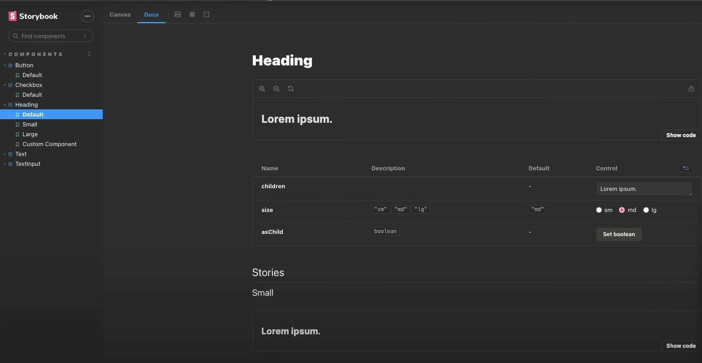

<h1 align="center" class="line-1 anim-typewriter"> Design System + Documentation Storybook
</h1>

<div align="center">
         
        
</div>

<br/>

<div align="center"  class="links">
        <a href="#challenge">challenge</a> |
        <a href="#built_with">built with</a> |
        <a href="#author">author</a> |
        <a href="#license">license</a> 
</div>

<br/>
<br/>

<h2 id="challenge"  align="center">⚡ The challenge </h2>

<div align="center">
   <p> Project development during the ignite lab event that ended in a few days, it was a great experience, learning more about UI development with FIgma, design system construction and documentation with Storybook. </p>
</div>

<br/><br/>

> <h3> Links : </h3>

Unstyled, accessible components for building high‑quality design systems and web apps in React.... [Learn More](https://www.radix-ui.com/docs/primitives/overview/introduction "Clique para ser redirecionado!").


Storybook is a frontend workshop for building UI components and pages in isolation. Thousands of teams use it for UI development, ... [Learn More](https://storybook.js.org/ "Clique para ser redirecionado!")


<br/><br/>

<h2 id="built_with"> 🧙‍♂️ Built with</h2>

<br>

<div align="center" class="container-icons">

<p float="left">


</p>
        
</div>

<br>

<br/>
<br/>
<br/>
<br/>

> <h3> Getting start : </h3>
> <br/>

<div>

1. <b>Clone the project</b>

```bash
  $ git clone https://github.com/gabriel-durr/design-system-storybook.git && cd design-system-storybook
```

2. <b>Install dependencies</b>

```bash
  $ npm i
```

3. <b>Start the application</b>

```bash
  $ npm run dev
  $ npm run storybook
```

</div>

<br>

<h5 id = "author" align="center"></h5>

<table align="center">
  <tr>
      <td>
      <a href="https://github.com/gabriel-durr">
        <br>
      </a>
      </td>
  </tr>
</table>

<div align="center">
        <sub><b><em>Made with 💜&ensp; by Gabriel Dürr </em></b></sub>
</div>

<br/>
<br/>
<br/>

<h2></h2>

<div align="center">
        
<h3 id="license" ></h3>

> This project is licensed under the &nbsp; [](LICENSE)

</div>
